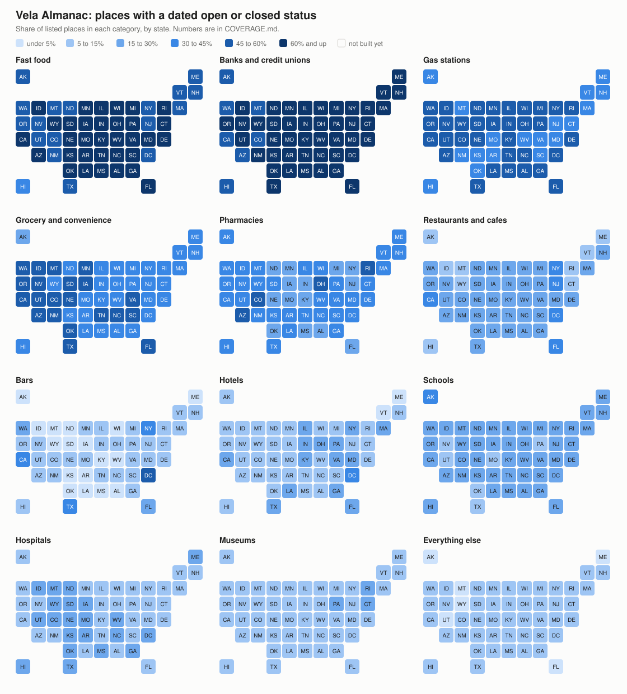

# Vela Almanac

An open table of every place in the United States a person can walk into,
rebuilt every month, that says for each one whether it is open, closed, or
has gone quiet, and shows the dated record behind that answer.

Maps go stale because nobody tells them when a shop closes. Regulators,
licensing boards and the chains themselves do know, and they publish it.
Vela Almanac collects what they publish. Each month it pulls from about
twenty public sources and merges them into one row per place:

- **The open map datasets**: Overture Maps, OpenStreetMap, and AllThePlaces,
  which reads every chain's own store locator.
- **Regulators and registers**: bank and credit union branch lists and
  closings, liquor license boards, restaurant inspections, the food stamp retailer list, the federal
  fuel tank registry, school, hospital and health provider registers, and
  nonprofit tax filings.
- **Signs of closure**: Foursquare closing dates, closures tagged by
  OpenStreetMap mappers, and places deleted or renamed in OpenStreetMap's
  edit history.

What comes out of the build of 2026-10-07, for all 50 states and DC:

| | |
| --- | ---: |
| Places | 19.4 million |
| Confirmed open by a dated record from the last two years | 1.6 million |
| Marked closed, with the date and the source | 129,000 |
| Added from a register because no map dataset had them | 212,000 |

Every place also gets an `open_score` from 0 to 1, so a reader can dim or
drop the ones nobody has vouched for in years.

The last row is the part a map cannot do on its own. A new bank branch, a
newly licensed bar or a store newly authorized for food stamps appears in
its register when the regulator lists it, which can be before anyone has
added it to a map.

Nothing is guessed. A place is only called closed when a source says so
with a date and nothing newer says otherwise, and every rule in the build
was checked by reading its matches. The rules that failed that check are
written down with their numbers in [SPEC.md](SPEC.md).

## Coverage by state

<picture>
  <source media="(prefers-color-scheme: dark)" srcset="docs/coverage-dark.svg">
  
</picture>

Interactive version, with the numbers on hover:
https://pimpinpumpkin.github.io/vela-almanac/ . The same numbers as a table are
in [COVERAGE.md](COVERAGE.md). Both are made by `tools/coverage_map.py`.

## Coverage by category

What the Almanac lists today, how much of it has a dated open or closed
record, and which public register can close the gap. Counts are from the
2026-10-07 build of all 50 states and DC: 19.4 million places, 8.9% of them
with a dated status.

| Category | Listed | Has a dated status | What it comes from, and what comes next | Can it be complete? |
| --- | ---: | ---: | --- | --- |
| Banks and credit unions | 215,405 | 67% | FDIC branches and closings, NCUA credit union offices (built) | Yes |
| Fast food and chain restaurants | 128,275 | 62% | Chain store locators (built) | Yes, for chains with a locator |
| Gas stations | 170,218 | 42% | Chain locators, EPA fuel tank registry (built) | Mostly |
| Grocery and convenience stores | 237,239 | 39% | SNAP authorized stores, chain locators (built) | Mostly |
| Pharmacies | 63,376 | 33% | Chain locators, NPPES (built). Next: state pharmacy boards | Mostly |
| Schools | 433,930 | 19% | NCES public schools (built). The category also holds preschools, private and trade schools, which NCES public data does not cover | Public schools yes |
| Restaurants and cafes, independent | 1,168,366 | 18% | Foursquare closing dates, OSM, alcohol licenses in California, Florida, New York, Texas and DC (built). Next: more state license lists, health inspections | State by state, never everywhere |
| Hotels | 115,020 | 13% | Chain locators (built). Next: state lodging licenses where published | Chains yes, independents patchy |
| Hospitals | 53,984 | 13% | CMS hospitals, NPPES (built). The category also holds departments and clinics listed as hospitals | Real hospitals yes |
| Museums | 37,106 | 11% | IRS exempt organizations (built) | Partly |
| Bars | 160,434 | 9% | Foursquare, OSM, alcohol licenses in California, Florida, New York, Texas and DC (built). Next: more state license lists | Where the state publishes its list, about half today. See below |
| Everything else | 16,374,029 | 6% | Salons, repair shops, offices, clinics, churches. NPPES and IRS exempt organizations (built). Next: state professional and repair licenses | No. This is the long tail |
| EV chargers | | | Not handled yet. The federal station list needs a free API key | Yes, if a key is allowed |
| Parks | | | OSM. Parks rarely close, so a listing is most of the job | Listing yes, status not needed |

The split by state is in [COVERAGE.md](COVERAGE.md).

Bars and restaurants are low because only California and DC have a license
list loaded. Where there is one, it helps but does not finish the job:
inside the District of Columbia 48% of bars and 42% of restaurants have a
status, and in California 31% and 30%. Most of the rest are bar listings
that match no license at all. In DC those get a low `open_score` and a
`missing_license` flag, not a closed status (SPEC.md section 7).

"Next" sources are a plan. None has been fetched or checked yet.

Status: early. Every state builds each month and the files are published
as [releases](https://github.com/PimpinPumpkin/vela-almanac/releases).

## What it is

- **Base layer**, imported: Overture Maps places, OpenStreetMap named
  businesses and landmarks, AllThePlaces chain locations.
- **Evidence layer**: public records that say a specific place was open or
  closed on a specific date. Today: Foursquare closing dates, OSM lifecycle
  tags and survey dates, OSM edit history (through OpenPOIs), Wikidata
  dissolution dates, FDIC bank branches and branch closings, NCUA credit
  union offices, USDA SNAP authorized stores, the EPA fuel tank registry,
  CMS hospitals, NCES public schools, NPPES health care organizations, IRS
  exempt organizations, alcohol licenses in California, Florida, New York,
  Texas and the District of Columbia, Florida restaurant inspections, and presence in a chain's own store locator.
- **New places from registers**: a bank branch, SNAP store or licensed
  premises that none of the three base datasets lists is added as a place.
- **Output**: one row per place with a stable id, merged attributes, every
  source id it was built from, a status of open, closed or unknown with
  the date and source of the evidence that decided it, and an `open_score`
  from 0 to 1 for every place.

France is the first country after the US: a Paris test box builds with the
global signals plus SIRENE, the French business register (SPEC.md
section 10). It is not in the monthly release yet.

## What it is not

- Not a new survey. Every fact comes from a source listed in `SOURCES.md`.
- Not complete on status. Most places have no dated evidence and are
  `unknown`. Nationally 8.9% of places get a status. `unknown` means nobody
  has said, not "probably open".
- Maintained by the Vela Maps project (github.com/PimpinPumpkin/Vela).
  Anyone can use it, and nothing in it depends on Vela: readers fetch the
  published files.

## Layout

```
build.sh            build one region end to end
stats.sh            print the numbers for a built region
review.sh           print a fixed sample of matches for a person to read
regions.tsv         region boxes and which OSM extracts cover them
base/               importers: overture.sh, atp.sh + atp.py, osm.sh + osm.jq
signals/            closing signals joined by id: fsq_closed.sh, wikidata_p576.py
adapters/           one file per register: fdic, ncua, snap, epa_ust, cms, nces, nppes,
                    irs, abc_ca, abca_dc, sla_ny, tabc_tx, abt_fl, dbpr_fl_food; sirene.sh for
                    France
sql/                lib.sql (matcher), core.sql, full.sql, status.sql, publish.sql
tests/              matcher threshold tests
reports/            numbers from the last build of each region
tools/              coverage_map.py, which draws the by-state map and table
docs/               the map, and the interactive page served by GitHub Pages
build_all.sh        build every state in regions.tsv, on one machine
prepare.sh          fetch the files every state shares
```

## Build

Needs `duckdb` (built and tested with 1.5.4, with the httpfs and spatial extensions),
`osmium`, `jq`, `curl` and Python 3. No keys, no accounts.

```
duckdb -c "install httpfs; install spatial;"
duckdb < tests/match_test.sql
./build.sh dc-box
./stats.sh dc-box
./review.sh dc-box evidence fdic_history closed number
```

Downloads are cached under `data/`, which is not in git. The first build
fetches about 5 GB (AllThePlaces is 2.6 GB and NPPES 1.2 GB of that). After that a region
the size of Kentucky builds in about 35 seconds.

Every fetch sends
`User-Agent: VelaAlmanac/0.1 (open US places dataset build; https://github.com/PimpinPumpkin/vela-almanac)`.
Set `ALMANAC_CONTACT` to a URL or address to append a way to reach you.

## Scheduled build

`.github/workflows/build.yml` runs on the first of each month and can be
started by hand from the Actions tab. One job fetches the national files
(`prepare.sh`), one job per state runs `build.sh`, and a last job publishes
every state's files as a GitHub release named for the build date, then
redraws the coverage map. A run started by hand with a list of regions is a
test and publishes nothing.

## Output

`data/out/core-<region>.parquet`, `data/out/places-<region>.parquet` and
`data/out/manifest-<region>.json`. See `SPEC.md` for the columns, the
matching rules and their measured accuracy, the status rules, and the rules
that were tried and thrown out.

Reading a box out of a published file:

```sql
select id, name, status, status_date, status_source
from 'places-kentucky.parquet'
where lat between 38.0 and 38.1 and lng between -84.6 and -84.4;
```

## Licenses

Copyleft throughout.

- **Code**: GNU Affero General Public License, version 3 or later. See
  `LICENSE`.
- **Data**: both published files are under the Open Database License 1.0.
  If you publish a database built from them, it has to be under the ODbL
  too. The full file has to be, because it contains OpenStreetMap data. The
  core file is built from permissive inputs only and is placed under the
  ODbL by choice.

Credit it as:

    Vela Almanac, (c) its contributors. Open Database License 1.0.
    https://github.com/PimpinPumpkin/vela-almanac

That line and the source notices in `NOTICE` must accompany any copy of the
data or any database built from it. Each manifest carries the same credit. Per-source terms are in
`SOURCES.md` and `SPEC.md` section 8.
